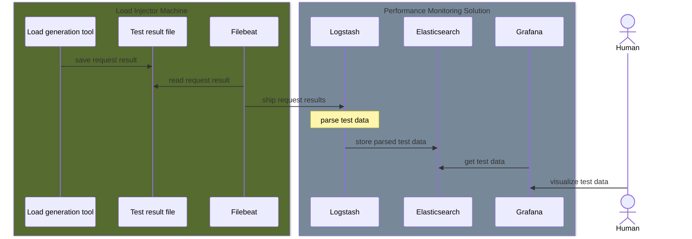

# Sample Apache JMeter project supporting 
## About

The sample Apache JMeter project supporting
[ELK-stack base performance testing monitoring solution](https://github.com/svikso/elk-perf-test-monitoring)

The project contains two parts:
*  [Apache JMeter](https://www.elastic.co/beats/filebeat) performance test plan.
*  [Filebeat](https://www.elastic.co/beats/filebeat) container shipping test results to
ELK-stack base performance testing monitoring solution

## How to run

In order to run the sample project correctly, execute the following actions:
1. Put valid Logstash `ca.crt` into `.\secrets\` folder.
This file should be copied from `.\secrets\ca\ca.crt` of the 
[monitoring solution](https://github.com/svikso/elk-perf-test-monitoring)
1. Set/Update environment variables in `.env` file.
1. Execute `chmod go-w filebeat/filebeat.yml` to ensure `filebeat\filebeat.yml` has write permission only for the owner
1. Execute `docker compose up -d`.
1. Check dashboards of the [monitoring solution](https://github.com/svikso/elk-perf-test-monitoring)

### Environment variables

1. `ELK_VERSION`: version of the Filebeat. It should match with the ELK-stack version
used by [monitoring solution](https://github.com/svikso/elk-perf-test-monitoring)
1. `LOGSTASH_HOST`: Logstash instance host or `hostname:port`
1. `TEST_ENV`: the name of the environment under test.
It should be equal to one of the `src\resources\envs` sub-folder.
1. `RUN_ARGUMENTS`: Maven run arguments.
1. `LOAD_PROFILE`: the name of the load profile config file.
This file should be located at `src\resources\common\load-profile` folder.
1. `TEST_ID`: the test id used by the monitoring solution to store results.
